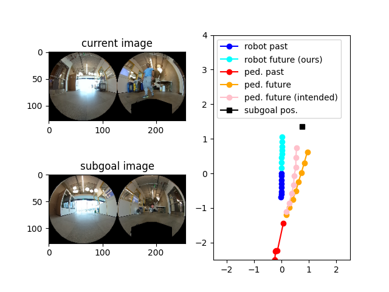

# SACSoN: Scalable Autonomous Control for Social Navigation
 
**Summary**: Our method, SACSoN can achieve the socially unobstrusive robot behavior in vision-based navigation by only using an RGB image. Our control policy is trained to minimize the counterfactual perturbation from the human intended trajectories. To accurately handle the counterfactual perturbation, we autonomously collected the HuRoN dataset by deploying our data collection system and train the dynamic forward model of the pedestrians.

Please see the [website](https://sites.google.com/view/SACSoN-review) for more technical details. And, we publish the HuRoN dataset on our project website.

#### Paper
**["SACSoN: Scalable Autonomous Control for Social Navigation"](https://arxiv.org/abs/2306.01874)**  
**[Noriaki Hirose](https://sites.google.com/view/noriaki-hirose/), [Dhruv Shah](https://people.eecs.berkeley.edu/~shah/), Ajay Sridhar, and [Sergey Levine](https://people.eecs.berkeley.edu/~svlevine/?_ga=2.182963686.1720382867.1664319155-2139079238.1651157950)**

#### Dataset
**[HuRoN dataset](https://sites.google.com/view/sacson-review/huron-dataset?authuser=0)**

#### Trained model
**[Trained model](https://drive.google.com/drive/folders/1jzSjj63I0NxdlfG0Js5oZ7GWyh30eYrb?usp=sharing)**

System Requirement
=================
Ubuntu 20.04

Pytorch 1.12.0

ROS Noetic(http://wiki.ros.org/noetic)

Nvidia GPU (But we confirmed that our policy can run at Intel NUC with core i5.)

How to use SACSoN
=================

#### Step1: Download
Code: https://github.com/NHirose/SACSoN.git

Trained Model: https://drive.google.com/drive/folders/1jzSjj63I0NxdlfG0Js5oZ7GWyh30eYrb?usp=sharing
(Please place the downloaded checkpoints in the directory "models".)

#### Step2: Camera Setup
We are releasing the trained model for the spherical camera. We recommend to use RICOH THETA S.(https://theta360.com/en/about/theta/s.html)
Please put the camera in front of your device(robot) at the height 0.35 m not to caputure your robot itself at the front side camera and connect with your PC by USB cable.

#### Step3: Publishing current image
Please publish your camera image on ROS. The topic name is defined as "/topic_name_current_image".
Our control policy is defined as the callback function of this topic. Since the frame rate of the image is same as the frame rate of the control policy, we highly recommend to be 3 fps to properly understand the pedestrians' behavior in our control policy.

If you use Ricoh Theta S, please check [our previous work](https://github.com/NHirose/DVMPC) and follow how to use it.

#### Step4: Publishing subgoal image
SACSoN generates the velocity commands to go to the goal position from the history of observations and subgoal image. Our code subscribes the subgoal image as "/topic_name_goal_image".
By updating the subgoal image, you can control the robot toward the far goal position.

#### Step5-1: Runing SACSoN on ROS
We can run our control policy as follows.

python3 sacson.py --robot_radius 0.5

Here, --robot_radius" is the robot radius to consider the size of robot itself for collision avoidance. Our code publishs the velocity commands as "/cmd_vel".

#### Step5-2: Runing SACSoN with sample data (without ROS)
We can run our control policy using the sample data without ROS. You can run our trained control policy and visualize the generated trajectories like the figure below. In this code, we run the pedestrians' dynamic forward model to estimate the counterfactual perturbation. although the subgoal position is the front right side, our control policy generates the velocity command to go straight ahead (not toward the front right), because the pedestrian is comming from the behind the robot and will walk through the right side. If the robot generates the velocity command directly toward the goal position, the counterfactual perturbation (trajectory difference between orange and pink lines) will be larger.

python3 sacson_sample.py --robot_radius 0.5

License
=================
The MIT License

Copyright 2023 Noriaki Hirose and others

Permission is hereby granted, free of charge, to any person obtaining a copy of this software and associated documentation files (the “Software”), to deal in the Software without restriction, including without limitation the rights to use, copy, modify, merge, publish, distribute, sublicense, and/or sell copies of the Software, and to permit persons to whom the Software is furnished to do so, subject to the following conditions:

The above copyright notice and this permission notice shall be included in all copies or substantial portions of the Software.

THE SOFTWARE IS PROVIDED “AS IS”, WITHOUT WARRANTY OF ANY KIND, EXPRESS OR IMPLIED, INCLUDING BUT NOT LIMITED TO THE WARRANTIES OF MERCHANTABILITY, FITNESS FOR A PARTICULAR PURPOSE AND NONINFRINGEMENT. IN NO EVENT SHALL THE AUTHORS OR COPYRIGHT HOLDERS BE LIABLE FOR ANY CLAIM, DAMAGES OR OTHER LIABILITY, WHETHER IN AN ACTION OF CONTRACT, TORT OR OTHERWISE, ARISING FROM, OUT OF OR IN CONNECTION WITH THE SOFTWARE OR THE USE OR OTHER DEALINGS IN THE SOFTWARE.

Citation
=================

If you use SACSoN's software or database, please cite:

@article{hirose2023sacson,  
  title={SACSoN: Scalable Autonomous Data Collection for Social Navigation},  
  author={Hirose, Noriaki and Shah, Dhruv and Sridhar, Ajay and Levine, Sergey},  
  journal={arXiv preprint arXiv:2306.01874},  
  year={2023}  
}

